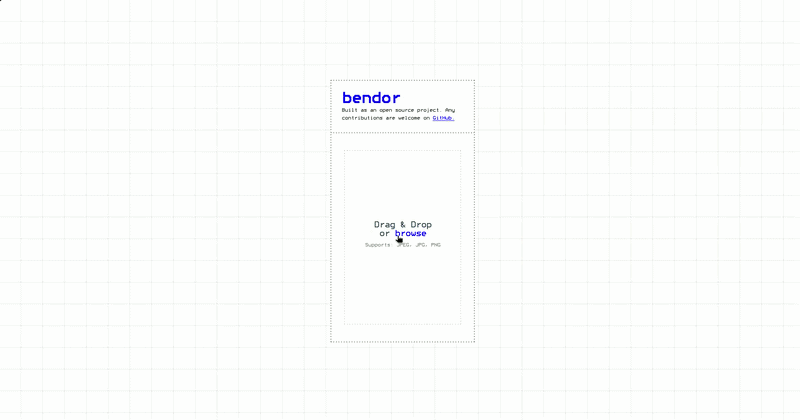
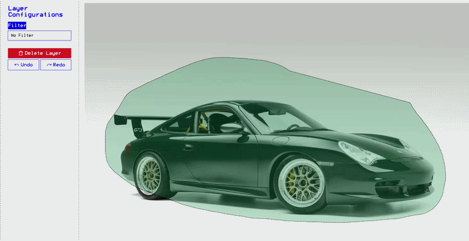
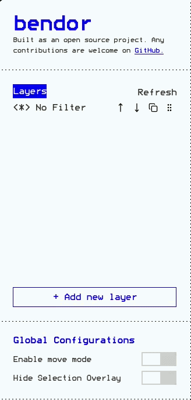
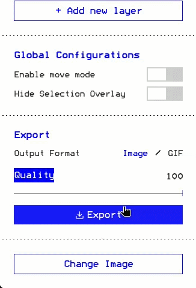
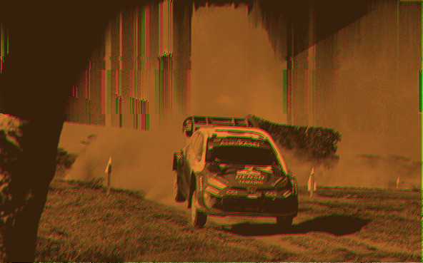
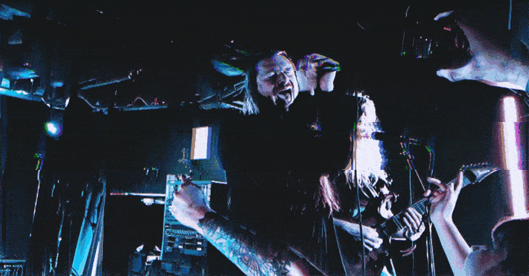

# bendor


A web-based image manipulation tool for creating some funky glitch visual effects. Built
for people who want experimental visuals without using desktop graphics software.

[Try it out](https://acrobatstick.github.io/bendor/)

## How to use

### Adding a picture

Before using the app, you'll need to add a picture to the canvas. Once your image is loaded, 
you can add a new layer and start applying selections to it.



### Applying selection to canvas

To select an area for a layer, drag your cursor over the image. The default selection
behavior works like a freehand tool, but without manually connecting the endpoints
yourself. Alternatively, you can single-click to select the entire image.


### Configuring the filter

Each filter has its own set of configurations, such as sliders and other controls, that 
you can use to adjust and refine your selection.



### Stacking filters

We provides the ability for you to combine or stack multiple filters together to create
a unique result. The order of the filter can be arranged by clicking the up/down arrow
or by dragging the grip icon and move it vertically.



### Exporting the result

If you're satisfied with the result, you can export the result to image or GIF



## Samples

### Static

With pixel sort and duotone filter applied



### GIF

With offset pixel sort and pixel sort applied




## Run locally

It is a pretty straight forward Vite + ReactJS project you can just simply do:

```bash
git clone https://github.com/acrobatstick/bendor.git
cd bendor
pnpm install
pnpm build
pnpm preview
```